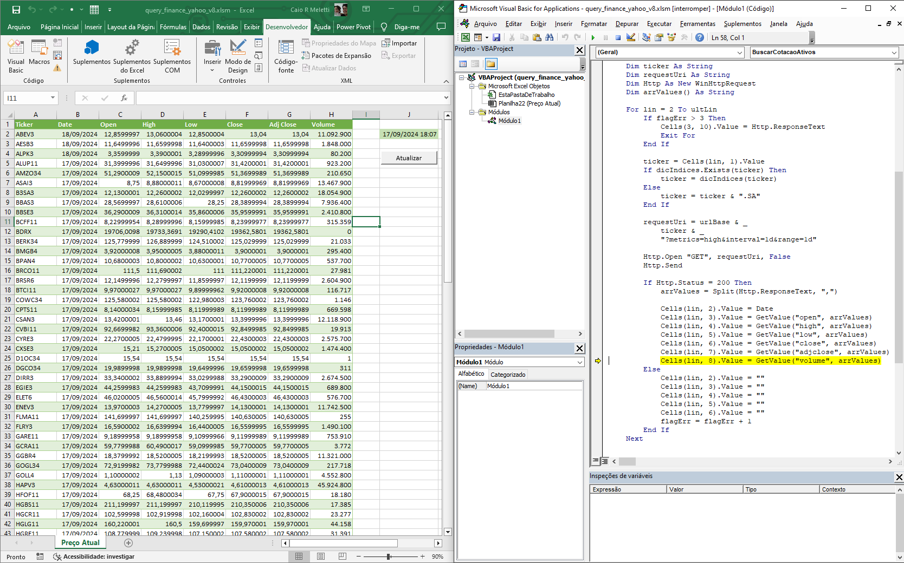
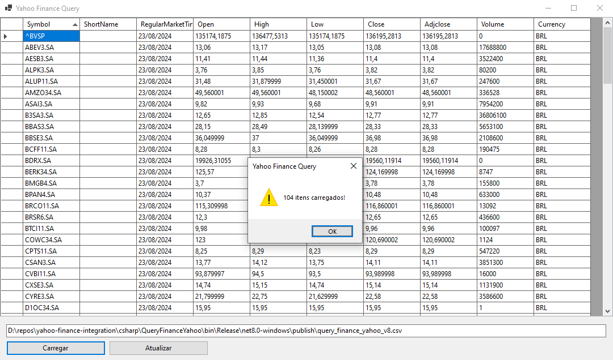
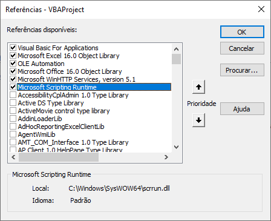
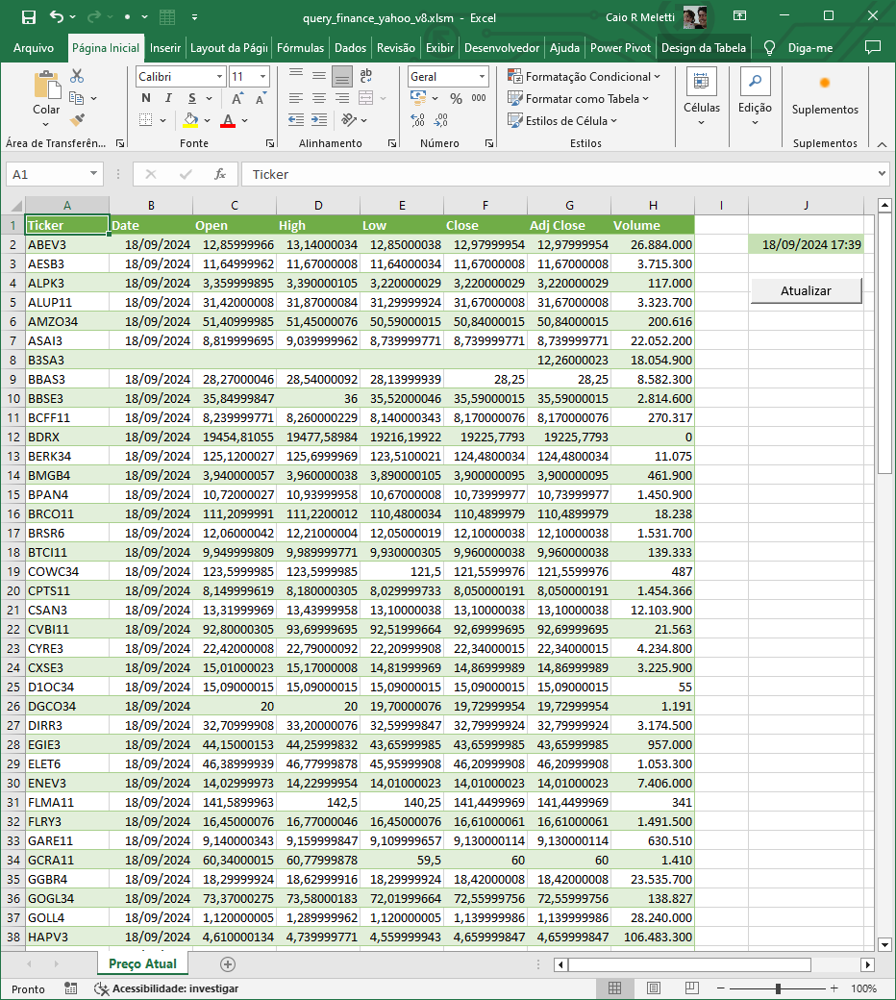
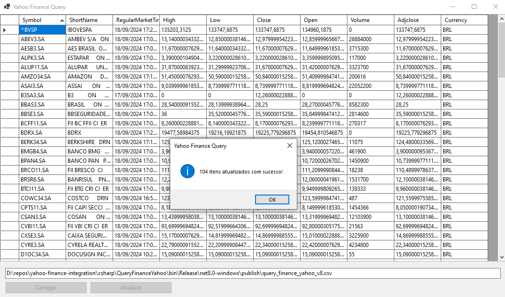

# yahoo-finance-integration


## Soluções
Foram desenvolvidas duas versões para integração com a API do Yahoo Finance:

### 1. Versão Excel VBA
Nessa versão a integração ocorre por meio da aplicação da linguagem VB Script que é utilizada no VBA (Visual Basic for Aplications), resultando em uma planilha do Excel que pode ser estendida para outros usos (montagem de carteira, lista de aportes, análise de rebalanceamento, etc).



### 2. Versão .NET / C#
Já esta versão explora as capacidades de integração utilizando a linguagem C#, gerando como saída um arquivo CSV que pode ser usado para alimentar outras fontes de dados.



 

> O objetivo das duas aplicações é utilizar os serviços da API do Yahoo Finance para obter os valores atualizados de ações (_stocks_) salvando o resultado em um arquivo XLS ou CSV que poderá ser utilizado como fonte de dados para outras aplicações.

### 🚧 Ajustes e melhorias

O projeto ainda está em desenvolvimento e as próximas atualizações serão voltadas para as seguintes tarefas:

- [x] Integração de VBA Excel com Yahoo Finance v7
- [x] Integração de VBA Excel com Yahoo Finance v8
- [x] Integração de .NET/C# com Yahoo Finance v8
- [x] Geração de interface WinForms
- [ ] Criação de interface Web

## 💻 Pré-requisitos

Antes de começar, verifique se você atendeu aos seguintes requisitos de acordo com a versão desejada:

> Independente de versão: você deve ter algum conhecimento sobre o **mercado de ações**.

### 1. Excel VBA
- Excel versão 2016 (ou superior)
- Habilitar `Microsoft Scripting Runtime`
    - No editor do Visual Basic, selecione o menu "Ferramentas; Referências" e marque a opção **Microsoft Scripting Runtime**
- Habilitar `Microsoft WinHTTP Services`
    - No editor do Visual Basic, selecione o menu "Ferramentas; Referências" e marque a opção **Microsoft WinHTTP Services**



### 2. .NET / C#
- `.NET` versão 8 (ou mais recente)
- Possuir uma máquina `Windows`
    - De qualquer forma vai funcionar no `Linux` ou no `Mac` porque foi utilizado o `.NET Core`.


## 🚀 Instalando Yahoo-Finance-Query

Para instalar o **Yahoo-Finance-Query**, siga estas etapas:

### 1. Excel VBA

> Faça do download da planilha **[query_finance_yahoo_v8.xlsm](https://github.com/caiomeletti/yahoo-finance-integration/blob/main/xls-macro/query_finance_yahoo_v8.xlsm)**

Caso você tenha feito download de todo o repositório, o arquivo estará na pasta:

    $\yahoo-finance-integration\xls-macro\query_finance_yahoo_v8.xlsm


### 2. .NET / C#

Após a clonagem do repositório, faça o build da aplicação:

```
dotnet publish -c Release csharp\QueryFinanceYahoo.sln
```

A publicação dos binários ocorrerá na pasta:

    $\yahoo-finance-integration\csharp\QueryFinanceYahoo\bin\Release\net8.0-windows\publish

## ☕ Usando Yahoo-Finance-Query

Para usar Yahoo-Finance-Query, siga estas etapas:

### 1. Excel VBA
- Abra o arquivo `query_finance_yahoo_v8.xlsm`
    - A lista de ações podem ser alterada conforme desejado
    - Não é necessário preencher todos os dados, somente a coluna `Ticker`
- Clique no botão `Atualizar`



- A planilha será atualizada com os valores referentes ao dia atual


### 2. .NET / C#

- Na pasta onde foi realizado o deploy (etapa anterior) existirá um arquivo de exemplo: `query_finance_yahoo_v8.csv`
- Altere esse arquivo, se desejar, incluindo ou alterando os *tickers* das ações que deseja obter dados (**não altere a linha de cabeçalho**)
    - Você pode criar outros arquivos que desejar, desde que mantenha a mesma estrutura de cabeçalho do CSV
    - Os *tickers* possuem um sufixo "**.SA**" que os identifica como ativos da B3 (Bolsa brasileira)
    - A inclusão de novos *tickers* pode ser feito diretamente pela interface do aplicativo
    - Não é necessário preencher todos os dados, apenas o código da ação (*ticker*) na primeira coluna
    - Caso não saiba o código da ação, consulte diretamente no [Yahoo Finance](https://br.financas.yahoo.com/lookup) 
    - É permitido incluir ações de outras bolsas, basta seguir o código adotado pelo Yahoo Finance


- Abra o aplicativo, executando o comando abaixo (ou clicando duas vezes sobre o arquivo executável):

```
$> CD yahoo-finance-integration
$\yahoo-finance-integration> csharp\QueryFinanceYahoo\bin\Release\net8.0-windows\publish\QueryFinanceYahoo.exe
```

- Clique no botão **Carregar**

    - O **arquivo** que está descrito na caixa de texto logo acima do botão será carregado com os dados disponíveis no mesmo (nomes de ações, valores, etc)

- Clique no botão **Atualizar**

    - Todos os itens da lista serão atualizados com base nos dados da API Yahoo Finance para os valores do dia atual
- O arquivo CSV será salvo com os dados atualizados

## 📫 Contribuindo para Yahoo-Finance-Query

Para contribuir com Yahoo-Finance-Query, siga estas etapas:

1. Bifurque este repositório.
2. Crie um branch: `git checkout -b <nome_branch>`.
3. Faça suas alterações e confirme-as: `git commit -m '<mensagem_commit>'`
4. Envie para o branch original: `git push origin <nome_do_projeto> / <local>`
5. Crie a solicitação de pull.

Como alternativa, consulte a documentação do GitHub em [como criar uma solicitação pull](https://help.github.com/en/github/collaborating-with-issues-and-pull-requests/creating-a-pull-request).

## 🤝 Colaboradores

Agradecemos às seguintes pessoas que contribuíram para este projeto:

<table>
  <tr>
    <td align="center">
      <a href="#" title="defina o título do link">
        <br>
        <sub>
          <b>Caio R. Meletti</b>
        </sub>
      </a>
    </td>
  </tr>
</table>

## 😄 Seja um dos contribuidores

Quer fazer parte desse projeto? Clique [AQUI](CONTRIBUTING.md) e leia como contribuir.

## 📝 Licença

Esse projeto está sob licença. Veja o arquivo [LICENÇA](LICENSE) para mais detalhes.